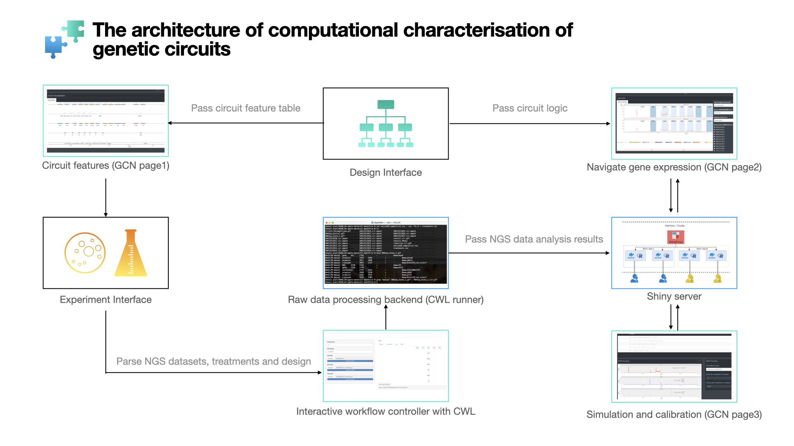
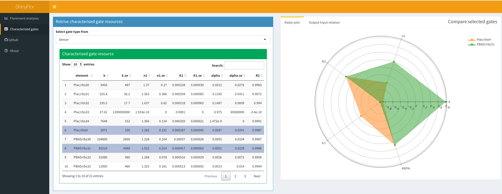

#\| layout-ncol: 2 #\| fig-format: svg #\| label: fig-charts #\|
fig-cap: "Real-world sensor composed by promoter lux and rbs 30" #\|
fig-subcap: #\| - "Input-Output relation" #\| - "Variation within
sampling points"

```{r setup, include=FALSE}
knitr::opts_chunk$set(eval = FALSE, include = FALSE)
library(plotly)

compare.io <- function(numvec,mytab, compare, Invalue, Outvalue, calfunc) {
    plotme <- mytab[numvec,]

    xrange <- plotme[,match(Outvalue,colnames(plotme))]

    minx <-  min(log10(xrange[xrange>0] / 100))

    maxx <- max(log10(xrange[xrange>0] * 100))

    x <- foreach::foreach(a=seq(minx,maxx,0.05),.combine = 'c') %do% 10^a

    mylist <- list(x)
    names(mylist) <- Invalue

    fig <- plot_ly()

    for(i in 1:length(plotme$element)) {
        y <- calculator(calfunc, variables = plotme[i,match(compare, colnames(plotme))], params = mylist )
        mytext <- do.call("paste0", foreach::foreach(a=compare, b=as.numeric(plotme[i,match(compare, colnames(plotme))])) %do% paste0(a,"=",b, "\n "))
        fig <- fig %>%
            add_lines(x=x, y = y,
                      name = plotme$element[i],
                      text = mytext,
                      line = list(shape = "spline")) %>%
            layout(xaxis = list(range = c(log10(min(x)), log10(max(x))),
                                type = 'log',
                                zerolinecolor = '#ffff',
                                zerolinewidth = 2,
                                gridcolor = 'ffff',
                                title = 'x'))
    }
    
    
    return(fig)
}

formula.not <- function() {
    expr(k3*(alpha3+(K3^n3)/(K3^n3+R3^n3)))
    #(K3^n3)/(K3^n3+R3^n3)
}

calculator <- function(fomula, variables, params) {

    with(c(as.list(params), variables), {
        eval(fomula)
    }, list())
}

texter.notgate1 <- TeX("f(R_\\text{3}) = k_\\text{3}*(\\alpha_\\text{3} + \\frac{{K_\\text{3}}^{n_\\text{3}}}{{K_\\text{3}}^{n_\\text{3}} + {R_\\text{3}}^{n_\\text{3}}})")
```

```{r functions, include=FALSE}
library(DiagrammeR)
library(rlang)
library(minpack.lm)
library(foreach)
library(dplyr)
library(shiny)
library(shinyBS)
library(shinycssloaders)
library(shinydashboard)
library(shinyjs)
library(shinyWidgets)
library(ggpubr)
library(tidyverse)
library(plotly)
```

## Contents {.smaller}

-   <div>

    Catchup on the background

    </div>

-   <div>

    Genetic gate characterization with Shinyflour with real-world
    Flourescence data

    </div>

-   <div>

    Noise reduction with bayesian Monte-Carlo Markov Chain
    (BayesianMCMC)

    </div>

-   <div>

    Updates on Bayesian Shinyflour

    </div>

    ## Genetic circuit design with NGS sequencing {.build}

{width="1000"}

## The role of fluorescent analyses in genetic circuit design

```{r chart3, fig.pos="H", echo=FALSE}
d <- DiagrammeR::grViz("
digraph {
  graph [rankdir = LR]

  subgraph cluster_0 {
    node [shape=box]
    'NGS sequencing'
    'Fluorescent analyses'
    label='Experiment Interface'
    color=gold
  }

  subgraph cluster_1 {
    node [shape=box]
    'Genetic gate parameters'
    'Circuit performance'
    label = 'Database'
    color=royalBlue
  }
  
  subgraph cluster_2 {
    node [shape=box]
    'ODE modeling'
    'Gate selection'
    label = 'Design'
    color=Blue
  }
  
  subgraph cluster_3 {
    node [shape=box]
    'ShinyFluor'
    'Genetic Circuit Navigator'
    label = 'Characterisation'
    color=red
  }

  'NGS sequencing' -> 'Genetic Circuit Navigator' 
  'Fluorescent analyses' ->  'ShinyFluor'
  'Genetic gate parameters' -> 'Gate selection' [label='curation']
  'Genetic gate parameters' -> 'ODE modeling'
  'ShinyFluor' -> 'Genetic gate parameters' [label='model fitting']
  'Genetic Circuit Navigator' -> 'Circuit performance' [label='debugging']
  'Circuit performance' -> 'Gate selection' 
  'Gate selection' -> 'Genetic Circuits'
  'Genetic Circuits' -> 'NGS sequencing'
  'Genetic Circuits' -> 'Fluorescent analyses'
}
", width="100%", height=250)

d
```

## Flourescent analyses with real-world datasets {.smaller}

-   <div>

    </div>

-   <div>

    Characterized gates resource: A page to present and compare
    pre-characterized gates and sensors

    </div>

-   <div>

    A help page for ShinyFluor workflow and input instructions

    </div>

## Gate characterization models \| Output-Input relations {.smaller}

-   Sensor
    $$f(I)=k*(\alpha + \frac{{I}^{n_\text{1}}}{{K}^{n_\text{1}} + {I}^{n_\text{1}}})$$
-   NOT Gate
    $$f(R_\text{3}) = k_\text{3}*(\alpha_\text{3} + \frac{{K_\text{3}}^{n_\text{3}}}{{K_\text{3}}^{n_\text{3}} + {R_\text{3}}^{n_\text{3}}})$$
-   AND Gate
    $$f(R,S) = G_\text{max}*\frac{{R/{K_\text{r}}}^{n_\text{r}}}{1+{R/{K_\text{r}}}^{n_\text{r}}}*\frac{{S/{K_\text{s}}}^{n_\text{s}}}{1+{S/{K_\text{s}}}^{n_\text{s}}}$$

## Scoring methods for gate resources \| Characterized gates resource {.smaller}

$$\begin{cases}
f(X)=(X-mean)/\sigma
\qquad (if \text{ larger x is preferred}) \\
f(X)=(mean-x)/\sigma
\qquad (if \text{ smaller x is preferred}) \\
\end{cases}
$$ {width="1000"}

## Characterisation workflow with ShinyFluor \| Statistical gate characterization with fluorescent assays (1)

-   Characterizing single-input gates and sensors

## Stanmodels: working with ShinyFlour {.smaller}

```{r chart1, echo=FALSE}

d <- DiagrammeR::grViz("
digraph {
  graph [rankdir = TB,fontsize = 18]

  subgraph cluster_0 {
    node [shape=box,fontsize = 18]
    'Select Gate Model'
    'Upload a fluorescent file'
    'Inspect distribution'
    label='Load datasets'
    color=gold
  }
  
  subgraph cluster_2 {
    node [shape=box,fontsize = 18]
    'Setting initials'
    'NLS Model'
    'Inspect prediction curves'
    label = 'NLS model fitting'
    color=royalBlue
  }
  
  subgraph cluster_3 {
    node [shape=box,fontsize = 18]
    'NLS parameters'
    'Bayesian MCMC parameters'
    label = 'Record Panel'
    color=red
  }
  
  subgraph cluster_4 {
    node [shape=box,fontsize = 18]
    'Load priors'
    'Stan scripting'
    'MCMC sampling'
    'Posterior distribution'
    label = 'Bayesian MCMC'
    color=royalBlue
  }

  'Upload a fluorescent file' -> 'Setting initials' 
  'Upload a fluorescent file' ->  'Inspect distribution'
  'Inspect distribution' -> 'Select Gate Model' [label='check', style ='dashed']
  'Select Gate Model' -> 'NLS Model'
  'Setting initials' -> 'NLS Model'
  'NLS Model' -> 'Load priors' [label='Enhance significance']
  'Load priors' -> 'Stan scripting' 
  'Stan scripting' -> 'MCMC sampling'[label='Rcpp compilation']
  'MCMC sampling' -> 'Posterior distribution' 
  'Posterior distribution' -> 'Bayesian MCMC parameters' [label='Success']
  'Inspect prediction curves' -> 'Setting initials' [label='failure',style ='dashed']
  'Posterior distribution' -> 'MCMC sampling' [label='failure',style ='dashed']
  'NLS Model' -> 'Inspect prediction curves'[style ='dashed']
  'NLS Model' -> 'NLS parameters' [label='Success']
  
}
", width="100%", height=200)

d
```

## Characterisation workflow with ShinyFluor \| Statistical gate characterization with fluorescent assays (2)

-   Characterizing 2-input gates

```{r chart2, fig.pos="H", echo=FALSE}
d <- DiagrammeR::grViz("
digraph {
  graph [rankdir = LR]

  subgraph cluster_0 {
    node [shape=box]
    'Select Gate Model'
    'Upload a fluorescent file'
    'Select sensor models'
    label='Step 1'
    color=gold
  }
  
  subgraph cluster_1 {
    node [shape=box]
    'simulate with sensor models'
    'Inspect sensor prediction'
    label = 'Step 2'
    color=royalBlue
  }

  subgraph cluster_2 {
    node [shape=box]
    'Inspect data distribution'
    'Setting initials'
    label = 'Step 3'
    color=royalBlue
  }
  
  subgraph cluster_3 {
    node [shape=box]
    'Model fitting'
    'Inspect prediction curves'
    label = 'Step 4'
    color=royalBlue
  }
  
  subgraph cluster_4 {
    node [shape=box]
    'Add to record'
    'Add to database'
    label = 'Step 5'
    color=red
  }
  
  subgraph cluster_5 {
    node [shape=box]
    'Sensor parameters'
    label = 'Gate resources'
    color=red
  }
  
  'Upload a fluorescent file' ->  'simulate with sensor models'
  'Select sensor models' -> 'simulate with sensor models'
  'Inspect sensor prediction' -> 'Setting initials' 
  'Setting initials' -> 'Model fitting'
  'Inspect prediction curves' -> 'Setting initials' [label='failure']
  'Model fitting' -> 'Add to record' [label='Success']
  'Add to record' -> 'Add to database'
  'Sensor parameters' -> 'Select sensor models'
}
", width="100%", height=300)

d
```

## Model fitting and NSL initals setting {.smaller}

$$f(R_\text{3}) = k_\text{3}*(\alpha_\text{3} + \frac{{K_\text{3}}^{n_\text{3}}}{{K_\text{3}}^{n_\text{3}} + {R_\text{3}}^{n_\text{3}}})$$

```{r eruptions}
inputPanel(
  numericInput('k3', "k3 (a.u.)", 5, min = 0, max = 1e6, value = 10000),
  numericInput('n3', "n3", 5, min = 0, max = 1e2, value= 3),
  numericInput('K3', "K3 (M)", 5, min = 0, max = 1e5, value=10),
  numericInput('alpha3', "α3", 5, min = 0, max = 1, value=0.001)
)


renderPlotly({
  plotme <- data.frame(element=c("control","update"),
                       k3=c(10000, input$k3 ),
                       n3=c(3, input$n3),
                       K3=c(10, input$K3),
                       alpha3=c(0.001, input$alpha3))
  
  compare.io(c(1,2), plotme, c("k3","n3", "K3","alpha3"),"R3","K3", formula.not() )
})
```

```{r}

mermaid("
graph LR
  A[file]-->B{Detect Extension}
  B-->C(.csv)
  C(.csv)-->D[CSV loader]
  B-->E(.xls or .xlsx)
  E(.xls or .xlsx)-->F[Excel loader]
  D-->G[Processor]
  F-->G
  G-->H{Outputs}
  H-->J[Spreadsheet 1]
  H-->K[Spreadsheet 2]
  H-->P[Spreadsheet ...]
")
```

## Notice on fluorenscent file inputs \| Sensors {.smaller}

The format of input files for sensors should be comma separated with I
as the column for inducer levels, while all other columns will be
recognized as replicates of fluorescent examinations.

|     | I     | set1    | set2    | set3   |
|-----|-------|---------|---------|--------|
| 1   | 0     | 0.003   | 0.0043  | 0.0063 |
| 2   | 0.001 | 0.0054  | 0.0032  | 0.0032 |
| 3   | 0.003 | 0.00643 | 0.00021 | 0.0043 |
| ... | ...   | ...     | ...     | ...    |

## Notice on fluorenscent file inputs \| NOT gates {.smaller}

The format of input files for NOT gates should be comma separated with
R3 as the column for inducer levels, while all other columns will be
recognized as replicates of fluorescent examinations.

|     | R3     | set1  | set2  | set3  |
|-----|--------|-------|-------|-------|
| 1   | 0      | 53454 | 23432 | 43211 |
| 2   | 0.0003 | 56544 | 35443 | 45433 |
| 3   | 0.0063 | 47766 | 45356 | 47643 |
| ... | ...    | ...   | ...   | ...   |

## Notice on fluorenscent file inputs \| AND gates {.smaller}

The format of input files for AND gate is different from above, due to
the dimensions of data information. the Fluorescent table for AND gates
should be comma separated with R3 as the column for inducer levels,
while all other columns will be recognized as replicates of fluorescent
examinations.

|     | Rep  | I1         | I2        | O         |
|-----|------|------------|-----------|-----------|
| 1   | set1 | 0          | 0         | 0.0000413 |
| 2   | set2 | 0          | 0         | 0.0000252 |
| 3   | set1 | 0.00016765 | 0.0000212 | 0.0000656 |
| 4   | set2 | 0.00016765 | 0.0000212 | 0.0000874 |
| ... | ...  | ...        | ...       | ...       |

## Future Steps {#future-steps .emphasized}

-   <div>

    Integate with larger databases: enabling systematical comparison of
    genetic elements

    </div>

-   <div>

    Add more gate models and transitions among different models

    </div>

-   <div>

    Provide further guidance on the help page

    </div>

