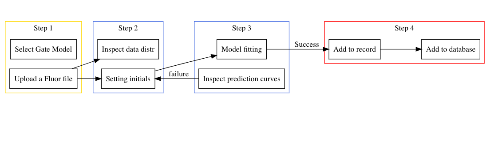
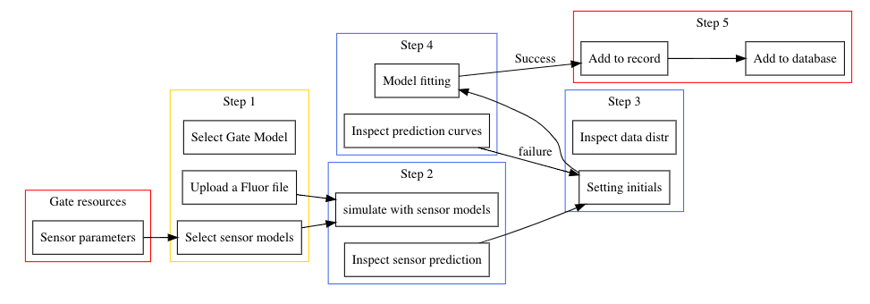

```{r setup, include=FALSE}
knitr::opts_chunk$set(echo = TRUE)
```


### 1. Introduction

### 2. ShinyFluor genetic gate resources

### 3. Workflow of gate characterization with ShinyFluor

#### 3.1. Characterising single-input gates and sensors



#### 3.2. Characterising 2-input gates


### 4. Build-in gate characterization models

-   Sensor: $$f(I)=k*(\alpha + \frac{{I}^{n_\text{1}}}{{K}^{n_\text{1}} + {I}^{n_\text{1}}})$$
-   NOT Gate: $$f(R_\text{3}) = k_\text{3}*(\alpha_\text{3} + \frac{{K_\text{3}}^{n_\text{3}}}{{K_\text{3}}^{n_\text{3}} + {R_\text{3}}^{n_\text{3}}})$$
-   AND Gate: $$f(R,S) = G_\text{max}*\frac{{R/{K_\text{r}}}^{n_\text{r}}}{1+{R/{K_\text{r}}}^{n_\text{r}}}*\frac{{S/{K_\text{s}}}^{n_\text{s}}}{1+{S/{K_\text{s}}}^{n_\text{s}}}$$

### 5. File uploading notice

First, ShinyFluor accept csv files (i.e. files with comma as separaters) **ONLY**. Csv files can be exported from many spread sheet software including Excel and Numbers, so please export your fluorescent tables to csv files before uploading them for analyses.

Second, the content of your table should be numbers **ONLY**, yet, numbers with exponential formats such as **0.32e-2** and **4.6e3** are **acceptable**.

#### 5.1 Fluorescent file input example (sensors)

The format of input files for sensors should be comma separated with I as the column for inducer levels, while all other columns will be recognized as replicates of fluorescent examinations.

#### 5.2 Fluorescent file input example (NOT gates)

The format of input files for NOT gates should be comma separated with R3 as the column for inducer levels, while all other columns will be recognized as replicates of fluorescent examinations.

#### 5.3 Fluorescent file input example (AND gates)

The format of input files for AND gate is different from above, due to the dimensions of data information. the Fluorescent table for AND gates should be comma separated with R3 as the column for inducer levels, while all other columns will be recognized as replicates of fluorescent examinations.

### 6. Communication with gate databases

### 7. Get in touch
